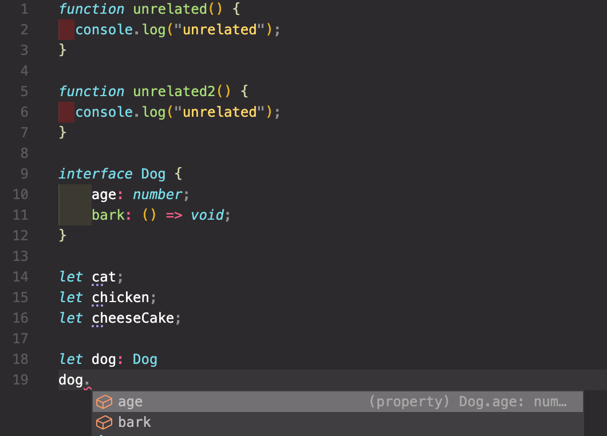

<h1>TypeScript</h1>

- 타입스크립트는, 자바스크립트로 컴파일되는, 자바스크립트의 타입이 있는 상위집합이다. (TypeScript is a typed superset of JavaScript that complies to plain JavaScript)

- <h3>타입이 있는 자바스크립트</h3>
  타입이 있는 자바스크립트란, 정확히는 정적 타입 시스템(static type system)을 도입한 자바스크립트라는 뜻이다. 정적 타입 시스템이 있는 언어, 즉 정적 타입 언어(statically typed language)에서는 프로그램의 예상 동작을 타입을 통해 나타내고, 그 예상에 걸맞게 동작할 지의 여부를 타입 검사기(type checker)를 통해 실행 전에 확인할 수 있다.

```js
function preferTypeScript(person) {
  return person.favoriteLanguages.includes("TypeScript");
}
```

위의 JS 코드를 TS로는

```ts
type Language = "TypeScript" | "JavaScript" | "Python" | "Rust" | "Haskell";
interface Person {
  favoriteLanguages: Array<Language>;
}
function preferTypeScript(person: Person): boolean {
  return person.favoriteLanguages.includes("TypeScript");
}
```

와 같이 나타낼 수 있다. 기본적으로는 같은 내용이지만 함수의 인자나 리턴 값 등이 만족해야 할 특정 조건에 대한 정보를 추가적으로 담고 있다는 정도로만 받아들이면 충분하다. 타입스크립트의 컴파일러에 의해, 이 코드는 앞서 봤던 것과 동일한 자바스크립트 코드로 컴파일된다.

```js
function preferTypeScript(person) {
  return person.favoriteLanguages.includes("TypeScript");
}
```

<h3>자바스크립트의 상위집합</h3>
다음으로, 타입스크립트는 자바스크립트의 상위집합이다. 정적 타입 시스템이라는, 기존 자바스크립트에 전혀 없었던 개념을 제공함에도 불구하고 타입스크립트는 자바스크립트와 완전히 동떨어진 다른 언어가 아니다. 모든 적법한 자바스크립트 코드는 적법한 타입스크립트 코드이며, 타입스크립트는 한 글자의 추가적 타이핑도 없이 자바스크립트 코드를 이해할 수 있다. 그 뿐만 아니라 거대한 자바스크립트 프로젝트에서의 점진적인 마이그레이션 또한 지원한다.

새로운 언어를 바닥부터 만드는 대신, 그 난해함으로 악명 높은 자바스크립트 코드를 포용하는 결정에는 분명 비용이 뒤따른다. 하지만 바로 그 결정으로 인해 타입스크립트 도입의 진입 장벽은 한껏 낮아졌다. 덕분에 전세계의 수많은 자바스크립트 프로젝트는 보다 적은 노력으로도 정적 타입 분석의 이점을 누릴 수 있게 되었다.

타입스크립트는 현존하는 자바스크립트의 문제를 풀기 위해 등장했고, 그 수단으로 정적 타입 분석을 내세웠다. 그렇다면 정적 타입 분석은 무엇이며, 어떤 장점을 제공할까? 정적 타입 분석을 제공하는 여러 대체재 중 타입스크립트를 사용해야 하는 이유는 무엇일까? 또 타입스크립트는 어떤 요소들로 구성되어 있으며, 어떤 역사를 가질까?

1장에선 이런 질문들에 대해 답하고자 한다.

<h2>1.1 정적 타입 분석</h2>

타입은 프로그램의 '올바른 동작'이 무엇인지에 대한 프로그래머의 의도를 인코딩하는 수단이다.

프로그램의 타입을 분석하는 방식을 기준으로 프로그래밍 언어를 크게 둘로 나눌 수 있다. 바로 프로그램이 실제로 실행될 때에 타입 분석을 진행하는 동적 타입 언어(dynamically typed language)와 프로그램을 실행해보지 않고도 런타임 이전에 진행하는 정적 타입 언어(statically typed language)다.

정적 타입 언어와 동적 타입 언어 중 어느 쪽이 더 우수한지에 대한 논쟁은 오래도록 이루어져 왔고, 아직도 명확한 승자는 정해지지 않았다. 정적 타입 언어는 프로젝트 초기에 더 많은 노력을 필요로 하는 경향이 있다. 또한 요구사항이 정확히 정해지지 않았거나 빠르게 변하는 경우(프로토타이핑 등) 적합하지 않은 도구일 수 있다.

정적 타입 분석이 제시하는 장점은 시스템의 평균적인 복잡도가 늘어남에 따라 빛나기 시작한다. 주요한 장점을 나열해 보면 다음과 같다.

<h3>보다 빠른 버그 발견</h3>

정적 타입 시스템은 프로그램이 실제로 실행되기 전에 상당수의 오류를 잡아낼 수 있다. 같은 종류의 오류가 동적 타입 언어에서는 코드 리뷰, 심지어는 실제 배포가 일어날 때까지도 발견되지 않는 경우도 잦다. 소프트웨어 개발 파이프라인에서는 오류가 늦게 발견될수록 더 큰 금전적, 시간적 비용을 치루어야 하므로 이는 매우 큰 이점이다.

ICSE(International Conferece on Software Engineering) 2017에 발표된 "To Type or Not to Type: Quantifying Detectable Bugs in JavaScript"이란 논문은 깃허브(GitHub)의 공개된 버그를 이용해 정적 타입 시스템의 효과에 대해 다룬다.

연구진은 실험군으로 설정한 자바스크립트 코드의 버그 중 약 15% 정도는 정적 타입 시스템이 있었다면 커밋조차 되기 전에 잡혔을 것이라 결론짓는다. 실사용자가 맞닥뜨리는 버그 중 15%를 사전에 예방할 수 있다는 인상적인 결과에 Microsoft의 한 엔지니어링 매니저는 다음과 같이 반응했다고 한다.

> 충격적이다. 만약 개발하는 방식에 어떤 변화를 줘서 저장소에 들어오는 버그 중 10% 이상을 줄일 수 있다면, 고민할 이유가 전혀 없다. 개발에 쓰이는 시간이 두 배 이상 늘어나는 수준이 아닌 한, 우리는 그 변화를 택할 것이다.

<h3>툴링</h3>

소스 코드에 대한 정적 타입 분석이 가능하다면 <b>컴파일러 및 코드 에디터가 코드를 실행하지 않고도 프로그램에 대해 훨씬 더 많은 정보를 알 수 있다.</b> 그리고 이 정보는 코드 작성 과정에서 유용하게 사용할 수 있다.

대표적인 예시가 바로 에디터의 자동 완성 기능이다. 만약 타입 시스템이 어떤 변수의 타입 정보를 정확히 안다면, 해당 변수의 멤버로 존재할 수 있는 변수만을 자동 완성 후보로 추천할 수 있다.


한편 타입 정보를 활용할 수 없는 상황에서는 데이터의 형태에 대한 확신을 가질 수가 없다. 이 경우 에디터는 해당 파일에 존재하는 식별자를 전부 늘어놓는 식의 휴리스틱 기반 대안으로 만족하게 된다. 물론 이는 상황에 따라(해당 객체의 형태가 코드 실행 전에 알려져있는가? 등) 그리고 편집기의 성능에 따라 달라진다. 하지만 타입 정보가 있을 때 더 신뢰도 높은 추천 결과를 얻을 수 있다는 사실은 명백하다.

그 외에도 정적 타입 분석을 이용해 프로그램을 더 잘 이해함으로써 다양한 편의기능을 구현할 수 있다. 일부 예시로 식별자의 정의로 바로 이동하는 기능(Go to Definition)이라든지 프로그램 전체에서 식별자의 이름을 바꾸거나 특정 코드 블록을 함수로 빼내는 등의 리팩토링 기능을 들 수 있다.

<h3>주석으로서의 타입</h3>

마지막으로, 타입은 프로그래머의 의도를 기술하는 주석과 같은 역할을 한다. 이 때 타입은 보통의 주석에 비해 더 강력한데, <b>타입 검사기에 의해 검사 및 강제되므로 프로그램의 동작과 일정 수준 이상 괴리될 수 없기 때문</b>이다. 예를 들어 아래 코드를 보자.

```ts
// 자기 자신을 리턴한다
function sum(a, b) {
  return a + b;
}
function concatString(a, b) {
  return a - b;
}
concatString("a", "b"); // NaN
```

위의 `sum`, `concatString` 함수는 각각 주석 또는 함수명을 읽고 추론할 수 있는 것과는 전혀 동떨어진 동작을 하고 있다. 하지만 이런 불일치에 불만을 가지는 건 프로그래머 뿐이다. 이 둘은 분명 유효한 자바스크립트 함수이며, 자바스크립트 실행기는 조금의 거리낌도 없이 이들을 실행할 것이다.

이런 상황이 생기는 원인은 주석과 변수명은 상대적으로 추상적인, 프로그램의 실제 동작과 직접 상호작용하지 않는 정보이기 때문이다. 반면 타입은 어떨까? 아래 타입스크립트를 보자.

```ts
type IdentityFunction = (a: number) => number;
const sum: IdentityFunction = (a: number, b: number) => {
  return a + b;
};
// error TS2322: Type '(a: number, b: number) => number' is not assignable to type 'IdentityFunction'.
function concatString(a: string, b: string): string {
  return a - b;
}
// error TS2322: Type 'number' is not assignable to type 'string'.
// error TS2362: The left-hand side of an arithmetic operation must be of type 'any', 'number' or an enum type.
// error TS2363: The right-hand side of an arithmetic operation must be of type 'any', 'number' or an enum type.
```

두 함수는 각각 함수 아래에 주석으로 적혀진 오류를 발생시킨다. 올바르지 않은 타입 정보를 가진 프로그램을 실행할 수단이 원천적으로 차단되는 것이다. 주석이나 변수명과는 다르게, <b>타입 정의와 다르게 동작하는 프로그램은 실행 자체가 불가능하다</b>는 점에서 타입은 앞서 언급된 다른 수단보다 훌륭한 명세 수단으로 동작한다.

<h3>자바스크립트와 정적 타입 분석</h3>

자바스크립트는 기본적으로 동적 타입 분석을 채택한 언어이며, 그마저도 매우 미약한 수준이다. 때문에 아주 간단한 실수조차 실제로 코드를 실행 해 봐야만 잡아낼 수 있는 경우가 많다. 예를 들어, 아래 코드는 문자열을 써야 할 곳에 문자열이 아닌 객체를 사용하고 있다. 하지만 이런 간단한 오류조차 실제로 프로그램을 돌려 해당 코드가 실행되기 전에는 감지할 수 없다.

```js
const notString = { isString: false };
console.log(notString.substr(0, 1));
// TypeError: notString.substr is not a function.
```

간단한 애플리케이션을 만들 때라면 모를까, 이런 동작은 프로젝트가 커짐에 따라 아주 큰 걸림돌이 된다. 자바스크립트가 갈수록 다양하고 복잡한 용도로 쓰임에 따라 자연스레 코드 작성에 정적 타입 검사를 도입하고자 하는 다양한 시도가 등장했다.

이 책의 주인공인 타입스크립트를 비롯해 서문에서 언급된 페이스북의 Flow, 언어 수준에서 SPA를 기반에 두고 설계한 Elm, 하스켈의 영향을 크게 받은 PureScript, 0Caml에 기반한 ReasonML 등이 대표적인 예이다.

<h2>1.2 왜 타입스크립트인가</h2>

타입스크립트는 자바스크립트 개발에 정적 타입 시스템을 도입하고자 시도한 수많은 선택지 중 현재 가장 많은 사용자 커뮤니티를 갖고 있다. 과연 타입스크립트는 어떤 장점 덕분에 다른 경쟁자를 제치고 선두주자의 위치를 차지할 수 있었을까?

<h3>자바스크립트의 상위집합</h3>

앞서 언급한 자바스크립트에 정적 타이핑을 도입한 시도 중 Elm이나 Reason, 또는 PureScript 등의 언어는 자바스크립트의 그것과는 상당히 이질적인 문법을 갖는다. 이러한 접근법은 자바스크립트의 문법에 얽매이지 않을 수 있다는 장정을 제공하지만, 다음과 같이 매우 명백한 단점 또한 따라온다.

- <b>기존 자바스크립트 코드베이스의 마이그레이션이 매우 비싸진다.</b> 전혀 다른 문법 탓에 사실상 프로젝트를 바닥부터 다시 작성하는 작업이 되기 때문이다.
- 기존 자바스크립트 프로그래머가 체감하는 <b>학습 곡선이 훨씬 가팔라진다.</b> 이는 곧 직장 및 프로젝트를 위한 구인의 어려움으로 이어진다는 점에서 치명적이다.
- <b>서드파티 자바스크립트 패키지의 사용이 어려워진다.</b> 심한 경우 불가능한 경우도 생긴다.

반면, 타입스크립트는 시작부터 수많은 기존 코드베이스와 생태계의 포용을 큰 우선순위로 두었다.

<b>모든 자바스크립트 코드는 타입스크립트 코드다.</b> 때문에 타입스크립트 컴파일러는 확장자만 바꾸면, 심지어는 (특정 옵션을 켠다면) 확장자를 바꾸지 않고도, 자바스크립트 코드를 이해한다. 뿐만 아니라 타입스크립트는 최신 ECMAScript 표준 및 여러 유용한 프러포절(부록2) 들을 지원한다.

이러한 접근을 통해 앞서 언급한 다른 접근법의 단점을 그대로 뒤집은 장정믈 얻게 된다.

- <b>기존 자바스크립트 코드베이스의 마이그레이션에 드는 노력이 적다.</b>
- <b>완만한 학습 곡선을 가지며 그 덕에 구인 또한 쉬워진다.</b>
- <b>서드파티 자바스크립트 패키지의 사용이 상대적으로 수월하다.</b>

<h3>트레이드오프</h3>

타입스크립트 깃허브 위키에는 <a href="https://github.com/Microsoft/TypeScript/wiki/TypeScript-Design-Goals">TypeScript Design Goals</a>라는 페이지가 있다. 이 문서는 타입스크립트를 만들며 목표로 삼았던 점(Goals)과 그렇지 않은 점(Non-goals)을 담고 있는데, 목표가 아닌 것들 중 흥미로운 항목이 있다.

> 안전하고 "증명 가능하게 올바른" 타입 시스템 적용하기. 그 대신 정확성과 생산성 사이의 균형을 노린다. Apply a sound or "provably correct" type system. Instead, strike a balance between correctness and productivity.

안전하고 올바른 타입 시스템을 적용하는 것이 목표가 아니라는 점은 언뜻 듣기엔 직관적이지 않다. 안정성을 위해 정적 타입 시스템을 도입하는 게 아니던가? <b>하지만 사실은 꼭 그렇게 말이 안되는 이야기만은 아니다.</b>

아래 코드를 보자.

```ts
function getFirstThreeCharsUnsafe(arg: { x: string | null }) {
  if (arg.x !== null) {
    window.alert("arg.x is string!");
    console.log(arg.x.substr(0, 3));
  }
}
```

3장에서 더 자세히 살펴보겠지만, 첫 줄의 `arg: { x: string | null }`은 인자로 받는 `arg`에 `x`라는 필드가 존재하고, 해당 필드가 `string` 또는 `null` 타입이라는 의미이다. 함수 내부를 보면, 먼저 `arg.x`가 `null`인지 여부를 체크한다. 만약 `null`이 아니라면 `arg.x`는 문자열이라 판단하고, 안심하고 `String.prototype.substr`을 호출한다.

별 문제가 없는 함수처럼 보이지만, 이 함수는 런타임 오류를 일으킬 수 있다. 다음 경우를 생각해보자.

```ts
var a: { x: string | null } = { x: "ok" };
window.alert = function (str: string) {
  a.x = null;
};
getFirstThreeCharsUnsafe(a);
```

위 코드는 <b>기존에 정의된 `window.alert` 함수를 덮어쓴다.</b> 새로 정의된 `window.alert` 는 호출되는 순간 `a.x`를 `null`로 바꿔버린다. `null`에는 `substr` 메소드가 없으므로 `getFirstThreeCharsUnsafe` 내의 `arg.x.substr(0, 3)`가 불리는 순간 `TypeError: Cannot read property 'substr' of null` 오류가 던져진다. 타입 검사를 통과했음에도 런타임 오류가 발생하는 것이다.

이를 예방하기 위해선, `if` 블록 안에서도 함수가 하나라도 호출된 시점에서, 해당 블록이 들어오게 한 조건문이 참일 것이라는 가정을 버려야 한다. 위 함수를 아래와 같이 다시 고치면 문제는 해결된다.

```ts
function getFirstThreeCharsSafe(arg: { x: string | null }) {
    if (arg.x !== null) {
        window.alert("arg.x is string!');
        if (arg.x !== null) {
            console.log(arg.x.substr(0, 3));
        }
    }
}
```

런타임 오류가 발생할 수 있는 경로가 명백하므로 '안전한' 타입 시스템은 `getFirstThreeCharsSafe` 처럼 함수 호출이 일어날 때마다 조건 검사를 다시 하도록 강제해야 한다. 실제로 <a href='https://flow.org/en/docs/lang/types-and-expressions/#soundness-and-completeness-a-classtoc-idtoc-soundness-and-completeness-hreftoc-soundness-and-completenessa'>안전성을 최우선 과제로 천명한</a> Flow는 `getFirstThreeCharsUnsafe`를 통과시켜 주지 않는다.

하지만 위 예시에서 나타나듯, <b>이런 정책은 가능성이 매우 낮은 경우를 커버하기 위해 아주 자주 발생하는 패턴의 코드를 장황하게 만든다.</b> 당장 작업중인 코드베이스의 `if` 문들을 살펴보고 이런 '안전한' 타입 시스템이 통과 시켜 줄 코드가 얼마나 되는지 찾아보라!

타입스크립트는 이런 경우 안전함을 다소 희생하는 선택지와 프로그래머를 짜증나게 하더라도 안전성을 택하는 선택지 중 후자의 비용이 더 크다고 판단한다. 때문에 <a href='https://github.com/Microsoft/TypeScript/issues/9998'>이런 문제를 알고 있음에도 불구하고</a> `getFirstThreeCharsUnsafe` 와 같은 사용법을 허용한다.

이렇듯 타입 안전성을 일부 희생하면서 사용성을 극대화시키는 과감한 선택 덕에 <b>타입스크립트 사용자는 생산성의 희생 없이도 대부분의 경우 안전한 코드를 작성할 수 있다.</b> 타입스크립트가 트레이드오프가 발생했을 때 내린 구체적인 선택에 대해서는 이후 하나씩 살펴본다.

<h3>VSCode</h3>

Visual Studio Code(이하 VSCode)는 Microsoft에 의해 개발되어 2015년 공개된 통합개발환경(Integrated Development Environment, IDE)이다. The State of JavaScript 2017 통계에 따르면 <b>응답자 중 가장 많은 수인 약 30% 가량이 VSCode를 사용한다.</b> Atom, Sublime Text 등의 다른 에디터에 비해 정식 출시가 가장 늦다는 점을 감안하면 상당히 고무적인 결과다.

또한 VSCode는 수많은 활발한 컨트리뷰터를 갖고 있다. Octoverse 2017에 따르면 <b>2017년 깃허브 전체 저장소 중 가장 많은 사람이 VSCode의 깃허브 저장소에 기여했으며, 해당 저장소에서는 전체 저장소 중 4번째로 많은 논의가 이뤄졌다</b>고 한다.

이렇게 많은 이들의 사랑을 받는 VSCode는 모든 언어에 사용할 수 있는 IDE를 지향한다. 하지만 그중에서도 VSCode와 타입스크립트가 갖는 관계는 특히 각별하다.

저장소에서 가장 먼저 눈에 띄는 점은 코드 90% 이상이 타입스크립트로 작성되었다는 점이다. 즉 <b>VSCode 개발팀은 타입스크립트 개발 환경을 개선할 만 한 아주 강한 인센티브를 가진다.</b> 실제로 현 시점에서 VSCode는 다른 어떤 툴보다도 강력한 타입스크립트 툴링을 갖고 있다. 그 때문일까? VSCode의 릴리즈 노트에서는 자바스크립트/타입스크립트 관련 변경 및 개선 사항이 유독 많이 눈에 띈다.

뿐만 아니라, <a href='https://devblogs.microsoft.com/typescript/'>타입스크립트</a>와 <a href='https://code.visualstudio.com/updates/v1_52'>VSCode</a>의 릴리즈 노트를 나란히 보면 종종 동일한 내용이 등장하는 것을 확인할 수 있다. 타입 정의 자동 설치 기능이 그 예시다. 이 기능은 2017년 10월 31일 <a href='https://devblogs.microsoft.com/typescript/announcing-typescript-2-6/'>타입스크립트 2.6 릴리즈 노트</a>에서 에디터가 곧 지원할 것이라는 코멘트 및 동작하는 버전의 gif 이미지와 함께 언급되었다. 그리고 얼마 후 2017년 11월 8일 <a href='https://code.visualstudio.com/updates/v1_18'>VSCode 1.18 버전 릴리즈</a>에 포함되었다.

이렇듯, Microsoft가 관리하는 이 두 프로젝트는 아주 긴밀하게 연결되어 있다. 이 둘의 상생관계는 앞으로도 굳건히 지속될 것이며, 두 프로젝트와 그들을 둘러싼 생태계에게 긍정적인 영향을 끼칠 것이다.
